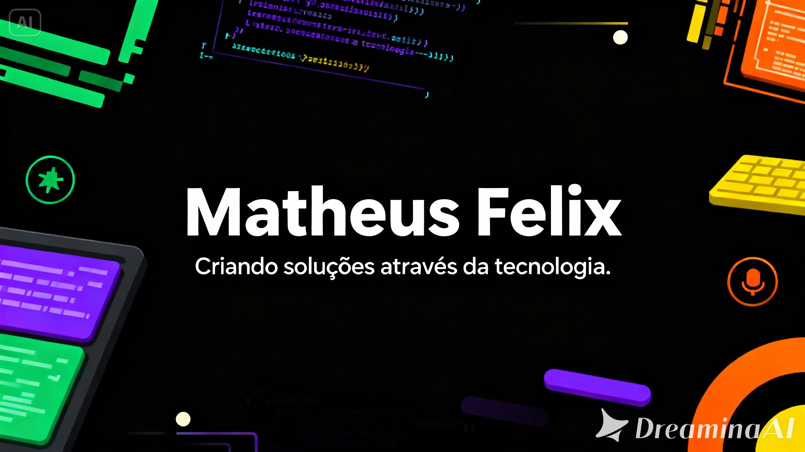

🎓 Estudante de **Análise e Desenvolvimento de Sistemas** na **FATEC-SP**  
💻 Focado em **desenvolvimento back-end** com **Java**, **Spring Boot** e **MySQL**  
🚀 Sempre em busca de aprimorar minhas habilidades através de projetos práticos  
🌱 Atualmente estudando **HTML**, **CSS** e **JavaScript** para fortalecer minha base web  
🎯 Objetivo: conseguir minha **primeira oportunidade de estágio em TI**

---

## 🧰 Tecnologias e Ferramentas
💬 Linguagens: **Java**, **C**, **SQL**, **JavaScript**  
🧱 Frameworks: **Spring Boot**, **Bootstrap**, **jQuery**  
🗄️ Banco de dados: **MySQL**  
🛠️ Versionamento: **Git** e **GitHub**

---

## 📂 Projetos em Destaque
🔹 [Página WEB](https://matheusf5.github.io/portfolio_iphone17/) — Página web desenvolvida com HTML5 e CSS3, utilizando tags semânticas e links de navegação entre páginas. Projeto criado para praticar estruturação, formatação de texto e fundamentos do desenvolvimento front-end.

🔹 [Página WEB Romantica](https://nosso-amor-1.vercel.app/) — Este projeto foi criado com muito carinho para a pessoa que transforma meus dias em momentos mais leves, felizes e cheios de amor.
Cada linha de código aqui representa um pedacinho da nossa história — construída com paciência, risadas, memórias e sonhos. Mais do que um simples site, este é um gesto digital do que sinto: algo que, assim como nós, foi feito para crescer, evoluir e durar. ❤️

---

## 📫 Como me encontrar
📧 **Email:** matheus.felix2205@gmail.com   
💼 **LinkedIn:** [linkedin.com/in/matheus-felix-/](https://www.linkedin.com/in/matheus-felix-/)

---

⭐ *“Transformando aprendizado em código e código em soluções.”*
